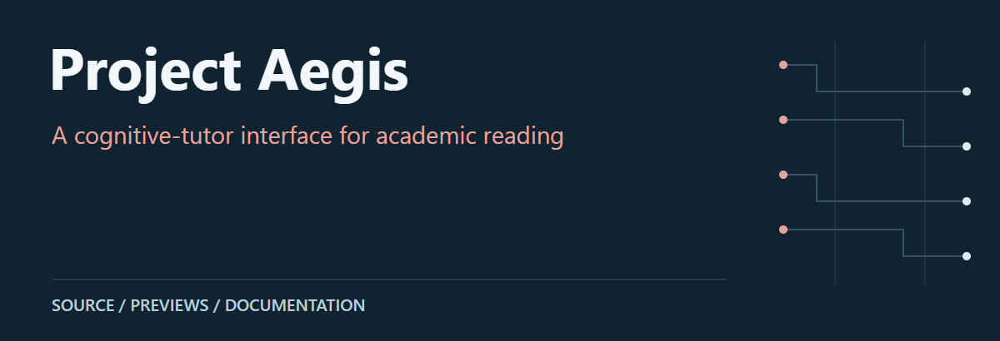
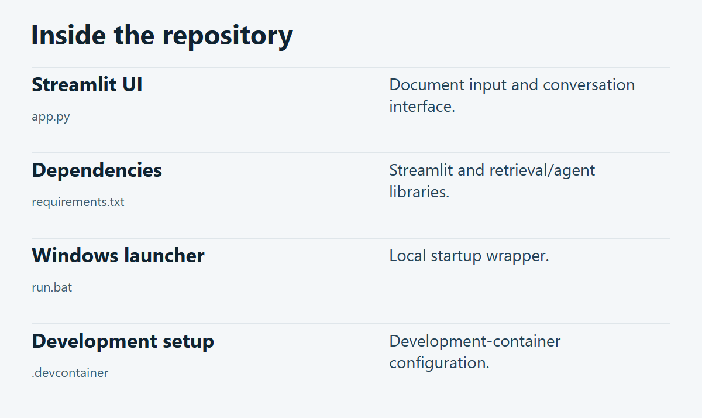

# Project Aegis

A Streamlit interface intended for document-grounded tutoring. The checked-in app imports a separate agent package for its graph, retrieval pipeline and response extraction.

**[Source guide](#source-guide)** · **[Getting started](#getting-started)** · **[Scope & limitations](#scope--limitations)**

## Source guide

| Component | Open source | Purpose |
| :-- | :-- | :-- |
| Streamlit UI | [`app.py`](app.py) | Document input and conversation interface. |
| Dependencies | [`requirements.txt`](requirements.txt) | Streamlit and retrieval/agent libraries. |
| Windows launcher | [`run.bat`](run.bat) | Local startup wrapper. |
| Development setup | [`.devcontainer`](.devcontainer) | Development-container configuration. |

## Getting started

Use the linked source files and project documents above as the entry points. Review the prerequisites and limitations below before execution.

## Scope & limitations

Repository limitation: app.py imports agent.graph, agent.rag, agent.nodes and agent.retriever_store, but the agent/ package is absent from the current tree. Restore that implementation before treating the application as runnable. The source guide below is not a working-app screenshot.

---

[Visual asset sources and presentation notes](docs/visuals/README.md)
