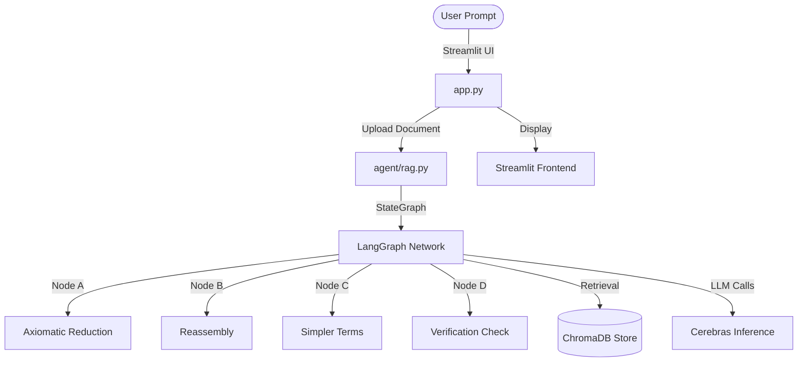

# AEGIS 🛡️ — Cognitive Tutor System

[](https://opensource.org/licenses/MIT)
[](https://www.python.org/)
[](https://streamlit.io/)
[](https://github.com/langchain-ai/langgraph)
[](https://cerebras.ai/)

**AEGIS** is a premium, hardware-accelerated **Agentic RAG (Retrieval-Augmented Generation)** deconstruction system. It leverages a stateful multi-agent LangGraph network and the lightning-fast **Cerebras Inference API** to ingest academic documents or corporate manuals and systematically break them down into first principles.

---

## 📖 Table of Contents

1. [Core Features](#-core-features)
2. [The ABCD Deconstruction Framework](#-the-abcd-deconstruction-framework)
3. [Architecture Overview](#-architecture-overview)
4. [Tech Stack Details](#-tech-stack-details)
5. [Interactive Installation & Setup](#-interactive-installation--setup)
6. [Usage Guide](#-usage-guide)
7. [License](#-license)

---

## ✨ Core Features

*   **⚡ Ultra-Fast Deductive Reasoning**: Sub-second LLM processing utilizing Cerebras hardware.
*   **📂 Vector Space Ingestion**: Local `all-MiniLM-L6-v2` embeddings combined with instant memory ChromaDB.
*   **🎚️ Dynamic Jargon Scaling**: Shift explainers from high-level mathematical abstractions to analogies on the fly.
*   **🔒 Secure Sandbox Operation**: Disables right-clicks and developer inspector console to safeguard core logic.

---

## 🌀 The ABCD Deconstruction Framework

Every concept queried is decomposed through our proprietary four-tiered cognitive deconstruction pipeline:

| Phase | Designation | Methodology |
| :--- | :--- | :--- |
| **A** | **Axiomatic Reduction** | Extracts absolute foundational truths, removing structural dependencies. |
| **B** | **Reassembly** | Synthesizes details sequentially from foundational truths to complex targets. |
| **C** | **Simpler Terms** | Invents a vivid, relatable 1:1 real-world analogy. |
| **D** | **Verification Check** | Posits a targeted question to confirm complete comprehension. |

---

## 📐 Architecture Overview



---

## 🛠️ Tech Stack Details

| Layer | Technology |
| :--- | :--- |
| **Agentic Framework** | LangGraph (StateGraph + MemorySaver) |
| **LLM Provider** | Cerebras Inference (ultra-fast, dedicated hardware) |
| **Embeddings** | HuggingFace `all-MiniLM-L6-v2` (local, no API cost) |
| **Vector Store** | ChromaDB (in-memory, per-session) |
| **UI** | Streamlit (premium dark glassmorphism theme) |
| **Document Loaders** | PyPDF + LangChain TextLoader |

---

## 🚀 Interactive Installation & Setup

<details>
<summary>📋 Step 1: Clone Repository</summary>

```bash
git clone https://github.com/MdSadman20040812/ProjectAegis.git
cd ProjectAegis
```
</details>

<details>
<summary>🐍 Step 2: Create Virtual Environment</summary>

```bash
python -m venv venv
venv\Scripts\activate      # Windows
# source venv/bin/activate  # macOS/Linux
```
</details>

<details>
<summary>📦 Step 3: Install Dependencies</summary>

```bash
pip install -r requirements.txt
```
</details>

<details>
<summary>🔑 Step 4: Configure Environment</summary>

Copy `.env.example` to `.env` and fill in your key:

```bash
copy .env.example .env
```

Edit `.env`:
```
CEREBRAS_API_KEY=your_cerebras_api_key_here
```
</details>

<details>
<summary>▶️ Step 5: Run AEGIS</summary>

```bash
streamlit run app.py
```

Then open your browser to: **http://localhost:8501**
</details>

---

## 📖 Usage Guide

1. **Launch** AEGIS via Streamlit
2. **Upload** your document (PDF or TXT) using the sidebar panel
3. **Ask** any question about the content in the chat input
4. **Adjust difficulty** on the fly:
   - Say `"simplify this"` or `"explain like I'm 5"` → removes jargon
   - Say `"go deeper"` or `"more technical"` → introduces formal math/nomenclature
5. **New Session** — click the reset button in the sidebar to clear memory and start fresh

---

## 📄 License

Distributed under the MIT License. See `LICENSE` for more information.

---

<div align="center">
  <sub>Built with rigor. Deployed with evidence. • 2026</sub>
</div>
