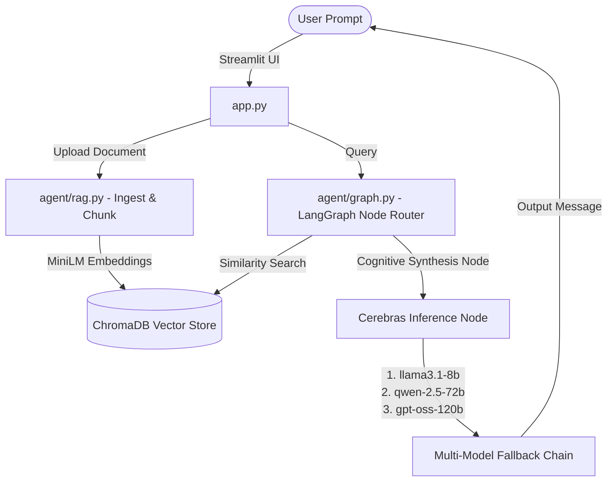

# AEGIS 🛡️ — Cognitive Tutor System

[](https://opensource.org/licenses/MIT)
[](https://www.python.org/)
[](https://streamlit.io/)
[](https://github.com/langchain-ai/langgraph)
[](https://cerebras.ai/)

**AEGIS** is a premium, hardware-accelerated **Agentic RAG (Retrieval-Augmented Generation)** deconstruction system. It leverages a stateful multi-agent LangGraph network and the lightning-fast **Cerebras Inference API** to ingest academic documents or corporate manuals and systematically break them down into first principles.

---

## 📖 Table of Contents
1. [Core Features](#-core-features)
2. [The ABCD Deconstruction Framework](#-the-abcd-deconstruction-framework)
3. [Architecture Overview](#-architecture-overview)
4. [Tech Stack Details](#-tech-stack-details)
5. [Interactive Installation & Setup](#-interactive-installation--setup)
6. [Usage Guide](#-usage-guide)
7. [License](#-license)

---

## ✨ Core Features

*   **⚡ Ultra-Fast Deductive Reasoning**: Sub-second LLM processing utilizing Cerebras hardware.
*   **📂 Vector Space Ingestion**: Local `all-MiniLM-L6-v2` embeddings combined with instant memory ChromaDB.
*   **🎚️ Dynamic Jargon Scaling**: Shift explainers from high-level mathematical abstractions to analogies on the fly.
*   **🔒 Secure Sandbox Operation**: Disables right-clicks and developer inspector console to safeguard core logic.

---

## 🌀 The ABCD Deconstruction Framework

Every concept queried is decomposed through our proprietary four-tiered cognitive deconstruction pipeline:

| Phase | Designation | Methodology |
| :--- | :--- | :--- |
| **A** | **Axiomatic Reduction** | Extracts absolute foundational truths, removing structural dependencies. |
| **B** | **Reassembly** | Synthesizes details sequentially from foundational truths to complex targets. |
| **C** | **Simpler Terms** | Invents a vivid, relatable 1:1 real-world analogy. |
| **D** | **Verification Check** | Posits a targeted question to confirm complete comprehension. |

---

## 📐 Architecture Overview



---

## 🛠️ Tech Stack Details

*   **Orchestrator**: LangGraph (StateGraph runtime with thread-specific state retention).
*   **LLM Platform**: Cerebras Inference (dedicated hardware for zero-latency streaming).
*   **Embeddings**: HuggingFace `sentence-transformers/all-MiniLM-L6-v2` (run locally).
*   **Vector Database**: ChromaDB (in-memory per-thread collection).
*   **User Interface**: Streamlit (Glassmorphism dark theme).

---

## 🚀 Interactive Installation & Setup

Follow these interactive steps to configure and launch AEGIS locally.

<details>
<summary>📋 Step 1: Clone the Repository</summary>

```bash
git clone https://github.com/MdSadman20040812/ProjectAegis.git
cd ProjectAegis
```
</details>

<details>
<summary>🐍 Step 2: Establish Virtual Environment</summary>

```bash
# Create environment
python -m venv venv

# Activate (Windows PowerShell)
.\venv\Scripts\Activate.ps1

# Activate (macOS/Linux)
source venv/bin/activate
```
</details>

<details>
<summary>📦 Step 3: Install Dependencies</summary>

```bash
pip install -r requirements.txt
```
</details>

<details>
<summary>🔑 Step 4: Add API Credentials</summary>

Copy the template `.env.example` to `.env` and insert your API credentials:
```bash
copy .env.example .env
```
Edit `.env`:
```ini
CEREBRAS_API_KEY=your_cerebras_api_key_here
```
*(Get a key from [Cerebras Console](https://cerebras.ai))*
</details>

<details>
<summary>⚡ Step 5: Start the Tutor App</summary>

For Windows users, double-click:
```bash
.\run.bat
```
Or execute manually:
```bash
streamlit run app.py
```
Open **`http://localhost:8501`** in your browser.
</details>

---

## 🖥️ Usage Guide

1.  **Ingest Content**: Upload any PDF or TXT paper in the left sidebar.
2.  **Submit Query**: Ask a question about any formula, system design, or concept in the document.
3.  **Command Jargon Shifts**:
    *   *Need it simplified?* Type `explain like I'm 5` or `simplify this`.
    *   *Need technical depth?* Type `go deeper` or `more technical details`.
4.  **Interactive Quiz**: Complete Phase D verification questions to lock in the knowledge.

---

## 📄 License

This project is licensed under the MIT License. See [LICENSE](LICENSE) for details.
