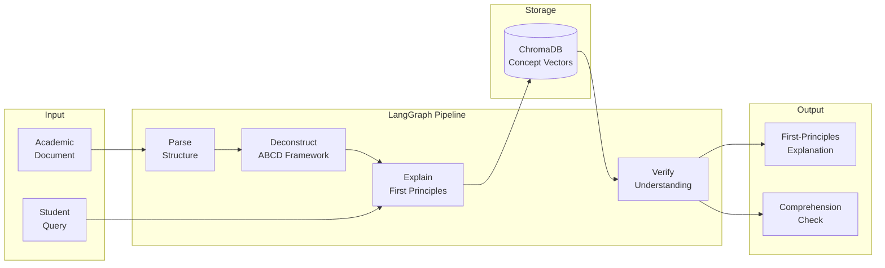

**Cognitive tutor — deconstruct academic documents into first principles via ABCD framework.**

---

## 🏗️ Pipeline



---

## ✨ Features

- **ABCD framework** — Anchor-Bridge-Construct-Deconstruct methodology
- **First-principles breakdown** — reduce complex topics to fundamentals
- **Concept mapping** — visual graph of concept dependencies
- **Comprehension check** — auto-generated quizzes from document content
- **Streamlit UI** — interactive tutoring interface

---

## 🚀 Quick Start

```bash
pip install -r requirements.txt
streamlit run aegis/app.py
```

---

## 📁 Project Structure

```
ProjectAegis/
├── aegis/
│   ├── app.py             # Streamlit UI
│   ├── graph.py           # LangGraph pipeline
│   ├── parser.py          # Document structure parsing
│   ├── deconstruct.py     # ABCD framework logic
│   ├── explain.py         # First-principles explanation
│   ├── quiz.py            # Comprehension verification
│   └── store.py           # Vector persistence
├── tests/
└── README.md
```

---

## 📄 License

MIT © Md Sadman Bin Masud
