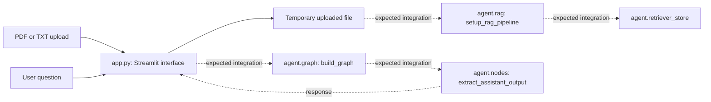

# ProjectAegis

**A document-centered cognitive tutor interface built with Streamlit.**

AEGIS presents a chat workspace for uploading PDF/TXT source material, asking questions, and requesting simpler or deeper explanations. The public source contains the interface and its integration points for a graph-based retrieval and tutoring backend.

> **Checkout status:** `app.py` imports an `agent` package that is absent from the public repository tree. A clean checkout is therefore incomplete and cannot run the tutor end to end as published. Installing the listed dependencies does not restore those project modules.

[Interface flow](#interface-flow) · [Quickstart-and-current-blocker](#quickstart-and-current-blocker) · [Source map](#source-map) · [Limitations](#limitations)

## What the interface contains

- PDF/TXT upload controls and a loaded-document indicator.
- A per-session thread ID, chat history, and graph invocation hooks.
- A “New Session” action that clears the listed Streamlit session-state fields.
- Instructions for asking questions and requesting “simplify” or “go deeper.”
- A styled Streamlit chat layout and a Windows launcher.

## Interface flow



Dashed edges identify calls to the **missing project package**. They show the interfaces expected by `app.py`, not a verified backend architecture. The embedding model, vector-store lifetime, provider configuration, and internal graph nodes cannot be confirmed from this checkout.

## Intended teaching approach

The project's original documentation describes an ABCD explanation format:

| Phase | Teaching goal |
| --- | --- |
| A — Axiomatic reduction | Identify foundational ideas |
| B — Reassembly | Build the explanation from those foundations |
| C — Simpler terms | Offer a relatable analogy |
| D — Verification check | Ask a comprehension question |

Treat this as the intended product experience. The missing backend prevents verification of how these phases are implemented or whether difficulty requests change its behavior.

## Quickstart and current blocker

### Prepare a checkout

The original setup targets Python 3.10+. These commands reference files that are present:

```bash
git clone https://github.com/MdSadman20040812/ProjectAegis.git
cd ProjectAegis
python -m venv venv
```

Activate the environment using your shell:

```bat
:: Windows Command Prompt
venv\Scripts\activate
```

```bash
# macOS / Linux
source venv/bin/activate
```

Install the declared dependencies:

```bash
pip install -r requirements.txt
```

### Configure locally

[.env.example](.env.example) documents `CEREBRAS_API_KEY`. Create your own local `.env` from that template and supply a key only in your local environment—not in an issue, screenshot, or commit. `app.py` calls `load_dotenv()`; the missing backend's consumption of this setting cannot be verified.

Do not rely on a repository-supplied `.env` or reuse any credential that may have been committed. Review secret handling and rotate any exposed key before deployment.

### Launch only after restoring the backend

Obtain the project's compatible `agent` package from the maintainer. The required module interfaces are listed in the diagram above; do not substitute an unrelated package with the same name.

The existing launch command is:

```bash
streamlit run app.py
```

`run.bat` is the Windows alternative and expects `venv\Scripts\activate.bat` beside the application. **Until the missing package is restored, an import failure is expected rather than a working tutor.** This documentation refresh did not launch the application or make an inference request.

## Source map

| File | Purpose |
| --- | --- |
| [app.py](app.py) | Streamlit UI, upload handling, session state, and backend calls |
| [requirements.txt](requirements.txt) | Declared LangChain/LangGraph, Streamlit, document, and embedding dependencies |
| [.env.example](.env.example) | Local environment-variable template |
| [run.bat](run.bat) | Windows launcher using the local `venv` |
| [.devcontainer/devcontainer.json](.devcontainer/devcontainer.json) | Development-container configuration |
| [.gitignore](.gitignore) | Repository ignore rules |

## Limitations

- Backend code is missing. No end-to-end tutoring, retrieval quality, latency, or provider/model claim is established by this checkout.
- Browser right-click and developer-key suppression is a UI behavior, **not a security boundary**. It does not protect source code, secrets, or uploaded documents.
- Uploads are written with `delete=False` to temporary files; `app.py` does not show cleanup. The “New Session” action does not prove deletion of those files or backend data.
- Document data flow to external services cannot be fully audited without the backend. Use non-sensitive samples until provider handling, retention, and access controls are reviewed.
- Dependencies are unpinned, and no license file is present in the inspected repository tree.

## Contribute

The highest-value contribution is a complete, secret-free backend with a reproducible installation path. Follow with an import smoke test, documented provider/model settings, temporary-file cleanup, and retrieval evaluations using public fixtures. Open an issue with the exact traceback and environment details; never include API keys or private source documents.
